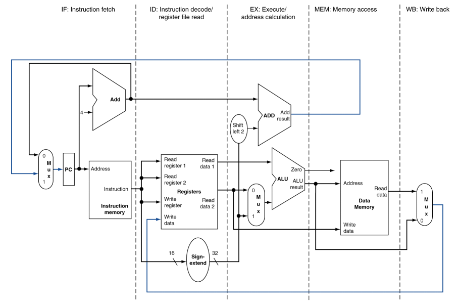
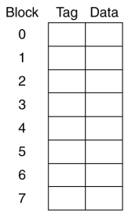
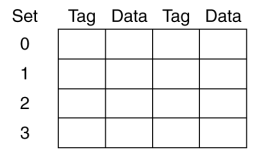
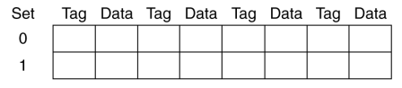
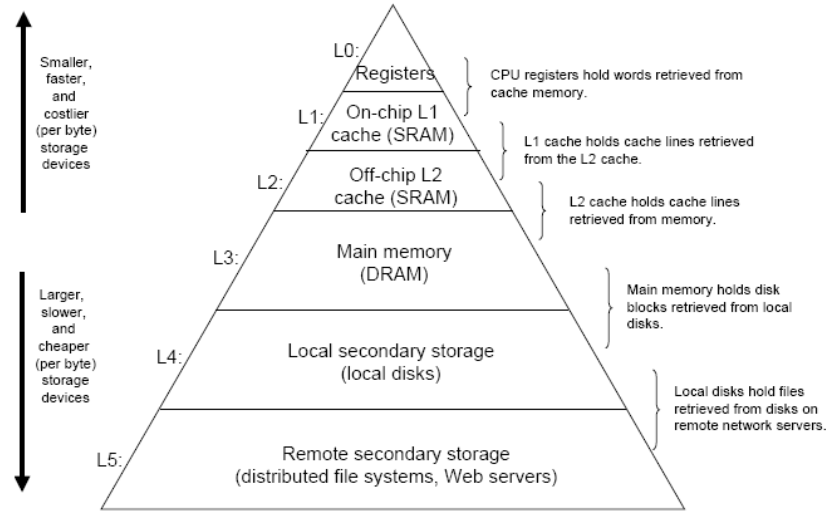
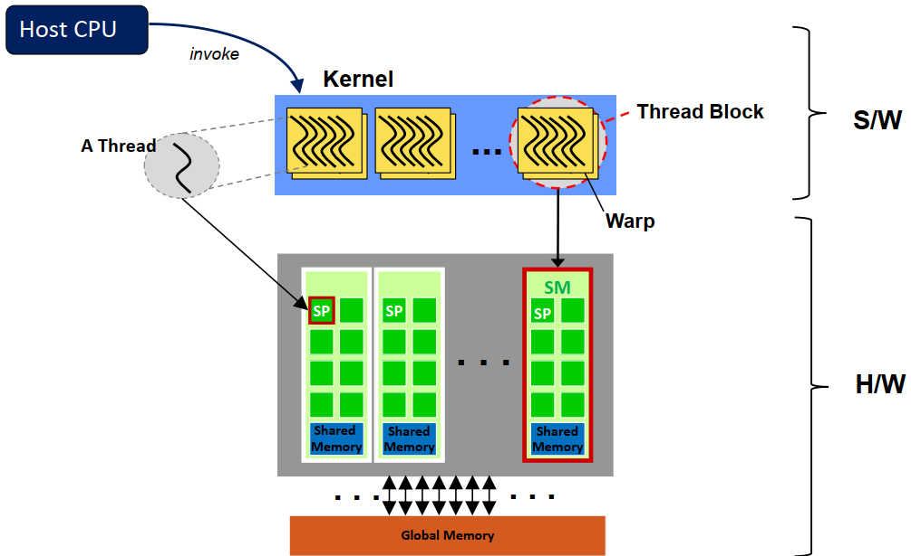
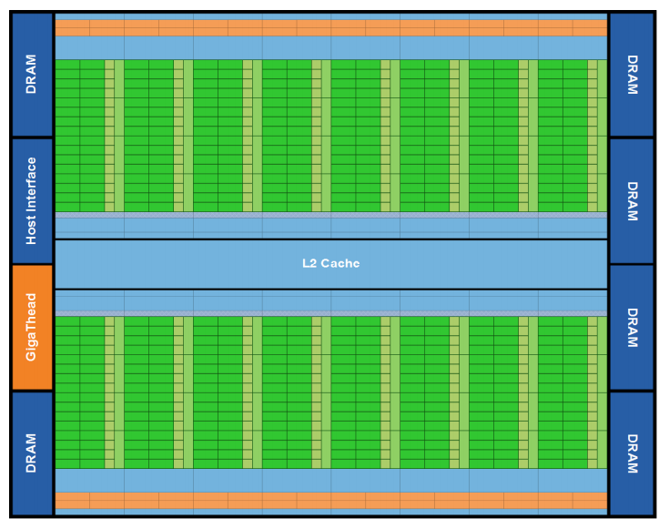
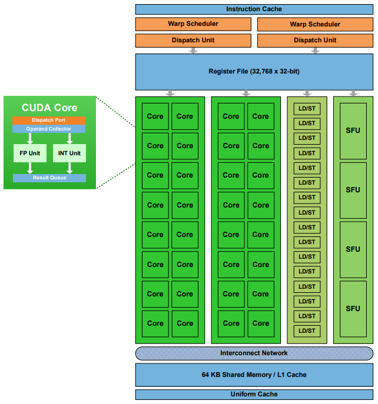
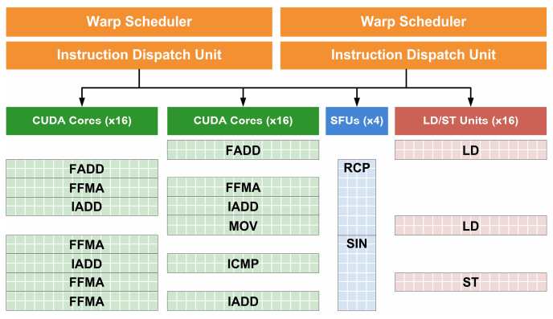
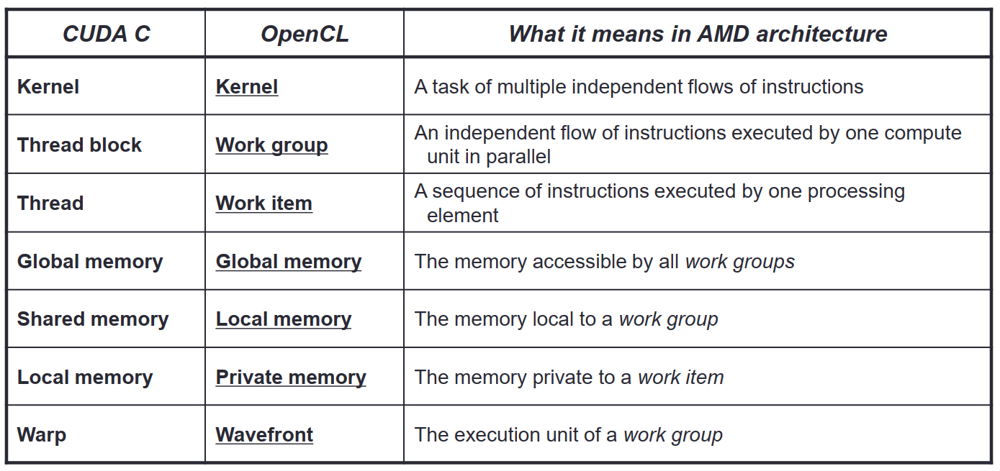

# GPU Tutorial

## Table of Contents
- [1. CPU and GPU](#1-cpu-and-gput)
- [2. Hardware and Software](#2-hardware-and-software)
- [3. GPU Memory Hierarchy](#3-gpu-memory-hierarchy)
- [4. GPU Core Microarchitecture](#4-gpu-core-microarchitecture)
- [5. Branch Divergence](#5-branch-divergence)
- [6. NVIDIA GPU Technologies](#6-nvidia-gpu-technologies)
- [7. AMD GPU Technologies](#7-amd-gpu-technologies)
- [8. GPU Interconnects](#8-gpu-interconnects)

## 1. CPU and GPU
### 1.1. Five-stage Processor Pipeline (CPU)
1. IF: Instruction Fetch
2. ID: Instruction Decode / Register File Read
3. EX: Execute / Address Calculation
4. MEM: Memory Access
5. WB: Write Back

### 1.2. Hazards 
Hazards: `Situations that stall the starting of the next instruction in the next cycle.` 
1. Structure hazards 
A required resource is busy. 
2. Data hazards 
Need to wait for previous instruction to complete its data read/write. 
3. Control hazards 
Deciding on control action depends on previous instruction. 

### 1.3. Out-of-Order (OoO) CPU
?

### 1.4. Associative Cache
- One-way set associative (direct-mapped) cache 

- Two-way set associative cache 

- Four-way set associative cache 

- Eight-way set associative cache 

### 1.5. Typical CPU Memory Hierarchy

- Block (Line): `Unit of copying, has multiple words.` 
- Hit: `If accessed data is present in upper level.` 
- Miss: `If accessed data is present in upper level.` 
Block copied from lower level, if it's a miss. 

### 1.6. Memory Locality
1. Temporal locality: `Items accessed recently are likely to be accessed again soon.` 
2. Spatial locality: `Items near those accessed recently are likely to be accessed soon.` 

## 1.7. Types of Parallelism
1. ILP: Instruction-Level Parallelism
2. MLP: Memory-Level Parallelism
3. TLP: Thread-Level Parallelism

## 1.8. History of GPU Evolution
GPU: Initially for Graphics 
Graphics-based GPU Pipeline (before 2006) Processor per function 
Vertex
-> Geometry
-> Pixel
-> Render Output Unit
-> Framebuffer

#### Unified Shader Model(GeForce 8 Series)
Any work can be performed on any shader
core -> High performance computing

Why?
Vertex Workload != Pixel Workload

Need balanced use of vertex shader and pixel shader?

After 2006
Vertex | Geometry | Pixel
-> Render Output Unit
-> Framebuffer

#### SM

#### Basic idea of high performance GPU
Many simple cores
- No fancy Branch prediction
- No Complex O-o-O control logic
- No memory prefetcher
- No cache coherence

Unified shader cores
- Sharing instruction stream across groups of fragments

Stall latency hiding
- When a group stalls, work on another group
Multiple Contexts(Thread groups/Warps) 
Can hide stall times

## 2 Hardware and Software

### CUDA
Grid <- Blocks <- Threads

Grid, Block
Number of blocks specified in three dimensions 
dimGrid(X, Y, Z)

example
Define how many blocks 
dim3 dimGrid(1, 1, 1);

Block, Thread
Number of threads per block is specified in three dimensions 
dimBlock(X, Y, Z)

example
Define how many threads per block. 
dim3 dimBlock(M.height * N.width, 1, 1);

Kernel is a dimGrid; 
each block in the grid has; 

example
MatrixMulKernel<<< dimGrid, dimBlock>>>(AonGPU, BonGPU, ConGPU); 

### Threads and Thread Blocks
### Thread Assignment

macroscopically
### NVIDA Fermi(GeForce400) pipeline microscopically

## 3 GPU Memory Hierarchy
### Layout

## 4 GPU Core Microarchitecture
- Fetch & Decode
- Scoreboard 
Traditional hazard detection score board for RAW and WAW hazards 
- Operand Collector, for Register Read
- Instruction Scheduler
- Execution Stage

### Four execution blocks within a Fermi SM

## 5 Branch Divergence

## 6 NVIDIA GPU Technologies
32 threads within a Warp

Streaming Multiprocessor: warps within a thread block 
Stream Processors: thread

kernel < thread block < warps < 32 threads

## 7 AMD GPU Technologies

## 8 GPU Interconnects

