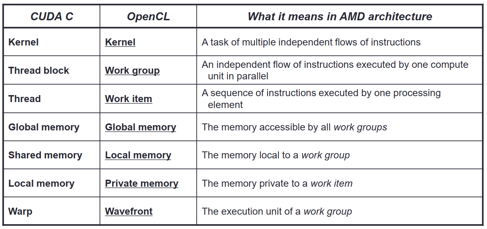

# GPU Tutorial

## Table of Contents
- [1 CPU and GPU](#1-cpu-and-gput)
- [2 Hardware and Software](#2-hardware-and-software)
- [3 GPU Memory Hierarchy](#3-gpu-memory-hierarchy)
- [4 GPU Core Microachitecture](#4-gpu-core-microachitecture)
- [5 Branch Divergence](#5-branch-divergence)
- [6 NVIDIA GPU Technologies](#6-nvidia-gpu-technologies)
- [7 AMD GPU Technologies](#7-amd-gpu-technologies)
- [8 GPU Interconnects](#8-gpu-interconnects)

## 1 CPU and GPU
### Hazards 
- Structure hazards 
A required resource is busy.
- Data hazards 
Need to wait for previous instruction to complete its data read/write.
- Control hazards 
Deciding on control action depends on previous instruction.

### Cache 
direct-mapped cache
associative cache

### 
Memory Hierarchy

###
block
hit
miss

Temporal locality
Spatial locality

ILP: Instruction-Level Parallelism
MLP: Memory-Level Parallelism
TLP: Thread-Level Parallelism

Unified Shader Model

Multiple Contexts(Thread groups/Warps) 
Can hide stall times

32 threads within a Warp

Streaming Multiprocessor: warps within a thread block 
Stream Processors: thread

kernel < thread block < warps < 32 threads

## 2 Hardware and Software

## 3 GPU Memory Hierarchy

## 4 GPU Core Microachitecture

## 5 Branch Divergence

## 6 NVIDIA GPU Technologies

## 7 AMD GPU Technologies

## 8 GPU Interconnects

